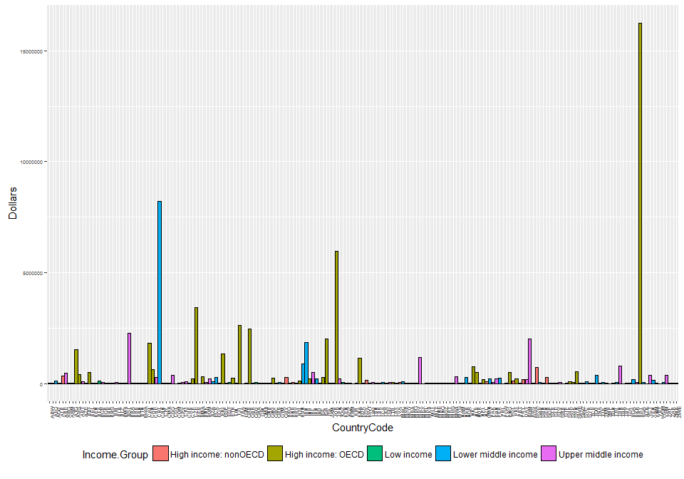

# Case Study 1
Anthony Dalton  
November 2, 2016  


With the amount of big data that exists in the world, it is imperative to use caution while merging documents. When exploring the GDP in relationship to educational data, this is magnified ten-fold. Using two data sources from The World Bank, we are exploring the education statistics dataset as well as the gross domestic product ranking table.  We will merge the data based of the key identifier of country code to explore trends by income groups using quantiles and graphical plots.

#### Using sourced data, merge the two clean datasets that exist in GetGDP.r and GetEdData.R

```r
#Merge the cleaned datasets into a new datafile named EdGDP
EdGDP <- merge(GDP,EdData,by = "CountryCode")
#Summary of columns in new EdGDP data frame
str(EdGDP)
```

```
## 'data.frame':	189 obs. of  6 variables:
##  $ CountryCode : Factor w/ 229 levels "","ABW","ADO",..: 2 4 5 6 7 8 9 11 12 13 ...
##  $ Rank        : num  161 105 60 125 32 26 133 172 12 27 ...
##  $ Economy     : Factor w/ 230 levels "","  East Asia & Pacific",..: 20 11 16 12 217 18 19 17 21 22 ...
##  $ Dollars     : num  2584 20497 114147 12648 348595 ...
##  $ Long.Name   : Factor w/ 234 levels "American Samoa",..: 5 57 99 108 226 4 109 2 15 110 ...
##  $ Income.Group: Factor w/ 6 levels "","High income: nonOECD",..: 2 4 5 6 2 6 5 6 3 3 ...
```

```r
#Question 1: Number of matched records between both datasets
nrow(EdGDP) 
```

```
## [1] 189
```
There are 189 matched ID's between both data frames.

#### Sort dataframe in ascending order by GDP

```r
#Question 2, sort data frame:
EdGDP <- EdGDP[order(EdGDP$Dollars),] 
#Question 2,Display the 13th country name in the data frame
EdGDP[13,3]
```

```
## [1] St. Kitts and Nevis
## 230 Levels:    East Asia & Pacific   Euro area ... Zimbabwe
```
There are two counties tied for 13th place, Grenada and St. Kitts and Nevis

#### Run means by income.group

```r
# Question 3:
# display the mean rank of income.group = "High income: OECD"
mean(EdGDP[EdGDP$Income.Group == "High income: OECD","Rank"])
```

```
## [1] 32.96667
```

```r
# display the mean rank of income.group = "High income: nonOECD"
mean(EdGDP[EdGDP$Income.Group == "High income: nonOECD","Rank"])
```

```
## [1] 91.91304
```
The mean rank for the High Income: OECD group is 32.9667. The mean rank for the High Income: nonOECD group is 91.9304

#### Plot GDP by country

```r
# Question 4
# Set the scientific notation penalty to 100 to display the large GDP amounts
options(scipen=100)
# Plot the GDP Dollars by country code and fill the geometric bar with income.group coloring
q <- ggplot(data=EdGDP, aes(x=CountryCode, y=Dollars, fill=Income.Group)) +
  geom_bar(colour="black", stat="identity") 
# since there are so many countries, shrink the size of the x axis text to make it human readable
q + theme(axis.text.x = element_text(angle = 90, hjust = .5),axis.text=element_text(size=5),legend.position="bottom")
```

<!-- -->

#### Setup quantile groups of GDP rankings

```r
# Question 5
# Create a new data frame named GDPQuartile that will split the data into quartiles and create a new column named quartile
GDPQuartile <- within(EdGDP, quartile <- as.integer(cut(Dollars, quantile(Dollars, probs=0:5/5), include.lowest=TRUE)))
# Display the data that is in quantile group 5 that also has income.group of lower middle income
subset(GDPQuartile, GDPQuartile$quartile == "5" & GDPQuartile$Income.Group == "Lower middle income")
```

```
##     CountryCode Rank          Economy Dollars                  Long.Name
## 51          EGY   38 Egypt, Arab Rep.  262832     Arab Republic of Egypt
## 165         THA   31         Thailand  365966        Kingdom of Thailand
## 77          IDN   16        Indonesia  878043      Republic of Indonesia
## 78          IND   10            India 1841710          Republic of India
## 34          CHN    2            China 8227103 People's Republic of China
##            Income.Group quartile
## 51  Lower middle income        5
## 165 Lower middle income        5
## 77  Lower middle income        5
## 78  Lower middle income        5
## 34  Lower middle income        5
```

```r
nrow(subset(GDPQuartile, GDPQuartile$quartile == "5" & GDPQuartile$Income.Group == "Lower middle income"))
```

```
## [1] 5
```
There are five countries in quantile group 5 that also have an income.group of lower middle income

### Findings
There are 189 countries that we were able to match records on between the GDP and education datasets from the World Bank. The United States of America has the highest GDP whereas Tuvalu has the lowest. The mean rank for the High Income: OECD group is 32.9667. The mean rank for the High Income: nonOECD group is 91.9304. There are five countries that are in the highest quartile that have an income.group of lower middle income: Egypt, Thailand, Indonesia, India, and China
